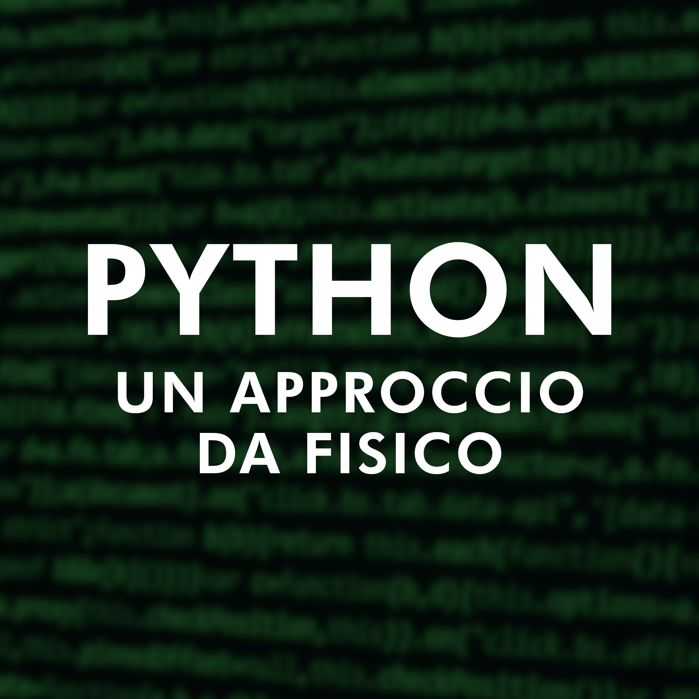

  
  <h1 align="center">Python: un Approccio da Fisico</h1>

Questa repository serve come risorsa per chiunque voglia approcciare Python con un punto di vista da "Fisico". 

## Per Iniziare

Per prima cosa dobbiamo installare Python! Per farlo useremo **Miniconda** che ci installerà `conda`, un gestore di ambienti di Python (per sapere cosa è un ambiente [guarda sotto](#python-ed-ambienti)).

Perciò scaricate l'[ultima versione di Miniconda per il vostro OS](https://docs.conda.io/en/latest/miniconda.html), seguite le istruzioni e lasciate tutte le impostazioni come da default. Per maggiori informazioni sull'installazione [consultate qui](https://conda.io/projects/conda/en/stable/user-guide/install/index.html).

Ora possiamo usare l'**Anaconda Prompt** per gestire i nostri pacchetti e gli ambienti.

### Python ed Ambienti

asod

## Consigli per Windows

Se avete Windows vi do qualche consiglio. Installate l'ultima versione di [Powershell](https://www.microsoft.com/store/productId/9MZ1SNWT0N5D) e poi installate anche [Windows Terminal](https://www.microsoft.com/store/productId/9N0DX20HK701).

**Windows Terminal** è un emulatore di terminale moderno e modificabile ampiamente, inoltre gira molto bene su Windows 11. Fate un profilo con Powershell di default, cambiate pure la cartella di base.

Per **settare conda** su questo terminale o aggiungete manualmente l'executable di conda alle _variabili d'ambiente_ oppure (quello che vi consiglio) aprite l'_Anaconda Prompt_ e scrivete `conda init powershell`. Lui si preoccuperà di inizializzare powershell per voi, ora potete usare **Powershell** come se fosse l'_Anaconda Prompt_.

Inoltre, se volete far girare degli script ad ogni avvio del terminale girate su Powershell `notepad $PROFILE` e accettate (solo la prima volta). Questo creerà un file **PROFILE** dove ogni riga verrà passata a _Powershell_ all'avvio. Una cosa che metto io spesso è `conda activate ambiente_che_uso_per_ora` per evitare di doverlo avviare ogni volta. 

**P.S.** se volete avere una linea di comando _spaziale_ allora date uno sguardo a [Oh My Posh](https://ohmyposh.dev/). E se volete usate pure il [mio tema custom](https://github.com/alex180500/simple-monokai).

## Licenza

Tutto il materiale è stato creato da **Alessandro Romancino** per il suddetto corso tenuto dal comitato locale _AISF Palermo_. Il materiale del corso è distribuito con _licenza MIT_, perciò siete liberi di **fare quello che volete** con il materiale.

Se volete, potete citarmi linkando il mio profilo [`https://github.com/alex180500`](https://github.com/alex180500). **Grazie!**